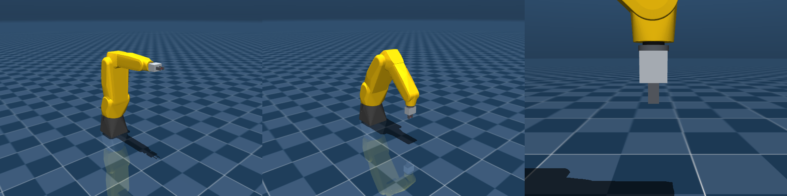

# FANUC LR Mate 200iD/4S + extension + SMC MHZ2-16D gripper — MuJoCo model

```
fanuc_lrmate200id_smc.xml   robot: arm + gripper + actuators + keyframes (home, ready)
scene.xml                   robot + floor + lights (load this one)
assets/lrmate200id4s/        LR Mate 200iD/4S meshes (STL, metres; NVIDIA Isaac Sim asset, CC BY 4.0)
preview.png                 home / ready / gripper close-up renders
```



## Run

macOS needs `mjpython` for the GUI viewer, and uv's standalone Python lacks the libpython it needs, so use the
helper env (one-off):

```bash
cd fanuc_lrmate200id_smc
bash twin/setup_env.sh                                       # creates .venv-twin
.venv-twin/bin/mjpython twin/twin.py --source demo           # opens the viewer with synthetic motion
```

From Python:

```python
import mujoco
m = mujoco.MjModel.from_xml_path("fanuc_lrmate200id_smc/scene.xml")
d = mujoco.MjData(m)
mujoco.mj_resetDataKeyframe(m, d, m.key("ready").id)   # "home" or "ready"
d.ctrl[:6] = [0, 0.4693, 0.1612, 0, -1.2627, 0]         # joint_1..6 target angles [rad] (the ready keyframe)
d.ctrl[6] = 0.0                                         # gripper: 0 = closed, 0.010 = open (m per finger)
mujoco.mj_step(m, d)
print(d.site("tcp").xpos)                               # tool centre point in the world frame
```

## What is in the model
* **Arm** — LR Mate 200iD/4S. Kinematics, joint limits and visual meshes from the NVIDIA Isaac Sim asset
  `Robots/Fanuc/lrmate200id4s` (CC BY 4.0; `twin/import_isaac_lrmate.py` exports it, see `assets/lrmate200id4s/README.md`).
  J1 at 330 mm, no J1–J2 offset, upper arm 260 mm, J3–J4 offset 20 mm, forearm 290 mm, J5 to flange 70 mm.
  Zero pose = upper arm up, forearm along +X. Limits: J1 ±170°, J2 −110…120°, J3 −69…205° (model J3), J4 ±190°,
  J5 ±120°, J6 ±360°. The old ROS-I `lrmate200id` meshes (the standard 200iD: 330/335 mm arm) in `assets/` are unused.
* **Tool** — flange → ~100 mm extension → SMC MHZ2-16D (pneumatic, DO 3 open / DO 4 closed), modelled with 10 mm
  travel per finger (2 mm closed pad gap, 22 mm open) so the 10 mm cube and the 13.4 mm pen fit.
  The TCP is 223 mm out of the flange: controller UTOOL 1 = (0, 0, 223) mm, read over RMI on 2026-09-23.
  Extension, gripper body and finger shapes are approximate outlines (`TOOL PARAMETERS` in the XML), not CAD.
* **Actuators** — 6 position servos (`joint_1..6`) + 1 gripper position actuator (`gripper`, 0 closed … 0.010 open).
  Bodies use gravity compensation, so joints hold their pose like a real FANUC servo.
* **Frames** — `flange`, `tool0` (ROS-I convention: +Z out of the flange; equals the FANUC tool frame) and `tcp` sites.

## Verified (2026-09-23, against the controller)
At pendant joints (3.94, −32.016, 4.576, 7.328, −94.549, 54.358) the model TCP with `J3_model = J3 + J2` lands on the
controller's UF0/UT1 XYZ (151.795, −26.885, −27.094) mm within 0.1 mm, and `tool0` matches the reported W/P/R exactly.
The previous model (standard 200iD, 95 mm TCP) was 88 mm off at the same pose. Rendered from the calibrated video0 camera
(`twin/align_scan.py --render --joints ...`), base, J1 and the tool land on the photo.

## Replace / calibrate (not real data)
* **Tool outlines** — the extension diameter, MHZ2-16D body size, finger length and pad gap are estimates; the wrist
  camera bracket on the gripper is not modelled. The TCP itself comes from the controller.
* **Link masses/inertias are estimates** and the servo gains (`kp`, `kv`) are generic.
* Collision uses the convex hull of each link mesh (MuJoCo default), so it is slightly conservative.

---

# Digital twin (`twin/`)

Real-time visualisation of the real robot's joints in the MuJoCo model. **Read-only**: the twin never
sends a motion instruction. `--source rmi` owns the RMI session and **must** be stopped with Ctrl+C
(so it can send `FRC_Abort` / `FRC_Disconnect`); killing the window leaves `RMI_MOVE` selected and
blocks the next live run. To watch while `run_fanuc_live` is moving the arm, use `--source udp`.

```bash
# 1. no robot: synthetic motion
.venv-twin/bin/mjpython twin/twin.py --source demo
# 2. real robot over FANUC RMI (same host/port as fanuc_replay_live.py)
.venv-twin/bin/mjpython twin/twin.py --source rmi --host 172.30.109.22
# 3. try the RMI path without a robot
.venv-twin/bin/python twin/mock_rmi_server.py --port 16001 &      # then: --source rmi --host 127.0.0.1
# 4. fed by another process that owns the RMI session
.venv-twin/bin/mjpython twin/twin.py --source udp --udp-port 5005
```

The viewer shows the arm, a blue trail of the TCP (`--trail N`) and a status light above the robot
(green = live, orange = data older than 0.5 s, red = no data). The terminal prints source status, update rate,
data age, J1–J6 in degrees, flange position, and a warning if a joint is outside its limit.

## Before trusting it on the real robot (two things I could NOT verify — no access to the controller)
1. **J2/J3 convention.** FANUC reports J3 coupled to J2; the model needs `J3_model = J3 + J2`. That is the default
   (`--j3-mode coupled`) and was confirmed against the controller on 2026-09-23 (see "Verified"). To re-check: put the robot at a pose with J2 ≈ 30–40°
   and run
   ```bash
   .venv-twin/bin/python twin/twin.py --source rmi --host 172.30.109.22 --check-cartesian
   ```
   It compares the controller's X/Y/Z with the model's forward kinematics for both conventions and tells you which
   `--j3-mode` matches (assumes UTool 0 / UFrame 0 are active). Also confirm visually that moving only J2 on the pendant
   matches the sim. Sign/offset differences on other joints would show up the same way.
2. **RMI session sharing.** RMI most likely allows one client at a time, so the twin (`--source rmi`) may not be able to
   connect while `fanuc_replay_live.py` is running, and `FRC_Initialize` from the twin could disturb a running session.
   Test it with the robot idle first (`--no-init` skips `FRC_Initialize`). To watch a replay/teleop run, let *that*
   process poll the joints on its own socket and forward them to the twin over UDP (`--source udp`), e.g. in
   `fanuc_replay_live.py`:
   ```python
   sys.path.insert(0, "/Users/zhangzijian/lerobot/fanuc_lrmate200id_smc/twin")
   from sources import JointStatePublisher, parse_joint_response
   pub = JointStatePublisher("127.0.0.1", 5005)
   # in AsyncStreamingSender._listen_acks, right after `resp = self.ls.read_json()`:
   if resp.get("Command") == "FRC_ReadJointAngles":
       pub.publish(parse_joint_response(resp)); continue
   # in main(), every ~30 ms: sender.ls.sendall(b'{"Command":"FRC_ReadJointAngles","Group":1}\r\n')
   ```
   The `first RMI joint response:` line printed by the twin shows the raw reply so you can confirm the field names
   (`JointAngle` / `J1..J6`); the parser also accepts a few variants.

## Overhead camera and table scan (`twin/align_scan.py`)

`overhead_camera.json` is video0 calibrated against the Scaniverse table scan and the 16 TCP-touched samples of
`table_xy_calib_samples_fanuc.json` (focal length, k1/k2 distortion, pose; samples 8 mm RMS). The previous file, fitted
by `overhead_camera.py` from an assumed table size, is kept as `overhead_camera.old.json`. `record_overhead.py` renders a
wider pinhole and remaps it through the lens (`twin/lens.py`), so sim overhead frames line up with raw 960x540 video0
frames; `--scan table.npz` uses the aligned scan instead of the flat table. Redo after the camera moves:
```bash
uv run python twin/align_scan.py --glb '../examples/cosmos_edge_fanuc/scanner/Scaniverse 2026-09-22 204107.glb' \
    --photo video0.jpg --out ../examples/cosmos_edge_fanuc/scanner/scan_204107      # empty-table 1920x1080 frame
uv run python twin/align_scan.py --export-overhead --out ../examples/cosmos_edge_fanuc/scanner/scan_204107
.venv-twin/bin/python twin/build_usd.py
```

**Wrist camera (`twin/calib_wrist.py`).** The Innomaker (/dev/video2) sits on a long bracket beside the gripper, rigid
to tool0 (it turns with J6), ~15 cm off the tool axis and looking ~28 deg off it; `wrist_camera.json` holds its
`T_tool_cam`, `K` and `dist` (the old hand-set file is `wrist_camera.old.json`). Calibrated from static poses
(stop the robot >= 3 s; vary TCP height 5-30 cm, J6 and tilt; keep the printed table in view), comparing each photo with
the aligned scan ray-cast into the wrist view. Accuracy ~1-2 cm on the table, limited by the scan alignment.
```bash
uv run python twin/calib_wrist.py capture --out ../examples/cosmos_edge_fanuc/scanner/wrist_calib/pose_07   # read-only RMI
uv run python twin/calib_wrist.py solve --poses ../examples/cosmos_edge_fanuc/scanner/wrist_calib \
    --scan ../examples/cosmos_edge_fanuc/scanner/scan_204107     # ~30 min; writes wrist_calib/calib_compare.jpg
```
`record_overhead.py` renders both cameras through their lens distortion.

## Scanned objects (`twin/crop_object.py`)

A photogrammetry scan of an object lying on a table (textured OBJ, metres, Y up; zip or folder) becomes a physics USD
asset: RANSAC table plane, crop of the connected piece standing above it, object frame (z up, x along the long axis,
origin on the surface), visual mesh + texture, and a capsule (elongated objects) or box collider with mass and friction.
```bash
uv run python twin/crop_object.py --scan ../examples/cosmos_edge_fanuc/scanner/objects/Pen.zip \
    --name pen --mass 0.015 --out ../examples/cosmos_edge_fanuc/scanner/objects/pen
```
The visual mesh is open underneath (the table hid it); physics uses the collider. Pen: 124 x 13.4 mm, capsule r 6.7 mm.
Open boxes use `--container`: colour crop (background sheets fused to the scan are grey/white), box axes from the face
normals with the scan's +Y up, origin at the bottom centre, and a hollow collider (floor slab + four walls):
```bash
uv run python twin/crop_object.py --scan ../examples/cosmos_edge_fanuc/scanner/objects/Bluebin.zip \
    --name blue_bin --mass 0.03 --container --out ../examples/cosmos_edge_fanuc/scanner/objects/blue_bin
```
Bins: blue 58 x 59 x 60 mm, orange 57 x 61 x 58 mm; openings ~34 mm, inner floor at ~25 mm. A 28 mm cube dropped in
lands on the floor; the pen (124 mm) only fits standing up and stays upright in the bin.

## Physics sim teleop (`twin/isaac_rmi_sim.py`)

Record teleop data in Isaac Sim with the real pipeline: the sim plays the FANUC controller over RMI, so `lerobot-record`
with `--robot.type=fanuc` and the telegrip VR teleop runs unchanged and records the real 7-D format. The action is the
operator's command; the state comes from physics (the LR Mate 200iD/4S articulation follows it through its drives, the
MHZ2-16D fingers close by force, objects move only by contact). Cameras (video0 and the wrist camera, lens distortion
included) are published over ZMQ for lerobot's `zmq` camera. Needs the Isaac asset once (`twin/import_isaac_lrmate.py`)
and `pyzmq` in both environments.
```bash
# terminal 1: the simulated controller + cameras, with a window to watch while teleoperating
OMNI_KIT_ACCEPT_EULA=YES LD_PRELOAD=/lib/aarch64-linux-gnu/libgomp.so.1 DISPLAY=:1 \
  ~/isaacsim-venv/bin/python twin/isaac_rmi_sim.py --scan ../examples/cosmos_edge_fanuc/scanner/scan_204107/table.npz --seed 0
# terminal 2 (repo root): record; hold the Quest grip to move, as on the real robot
uv run lerobot-record --robot.type=fanuc --robot.id=sim --robot.host=127.0.0.1 --robot.port=16101 --robot.sim_reset=true \
  --robot.cameras='{overhead: {type: zmq, server_address: 127.0.0.1, port: 5580, camera_name: overhead, width: 960, height: 540, fps: 30},
                    wrist: {type: zmq, server_address: 127.0.0.1, port: 5580, camera_name: wrist, width: 640, height: 360, fps: 30}}' \
  --teleop.type=telegrip --dataset.repo_id=<user>/fanuc_sim_teleop --dataset.single_task="put the black cube in the blue bin" \
  --dataset.num_episodes=10 --dataset.episode_time_s=60 --dataset.fps=30
```
`--robot.sim_reset=true` resets the scene automatically in the reset phase between episodes: the sim drops its motion
queue, puts the arm at the ready pose with the gripper open and lays the four objects out again (the next layout of the
`--seed` sequence), and `lerobot-record` forgets the teleop's latched origin, so the next grip starts from home. The flag
only sends the sim-only `SIM_Reset` command; leave it off on the real robot. `--seed` fixes the layout sequence.
The window shows the cell from where the operator stands at the real robot: the telegrip mapping sends controller
forward to +Y and right to +X (operator on the robot's -Y side facing +Y), so the default view (`--view-eye 0.30 -1.05
0.75 --view-target 0.30 0 0.05`) makes forward move the arm away on screen and right move it right. Recorded actions
are absolute UF0 poses, so the mapping only changes how the controller drives them, not what the data means. Checked with the real `Fanuc` driver: TCP tracks streamed
targets, a 10 mm cube is lifted by the fingers (physics), 1.0x real time headless on the GB10. A sim-only
`SIM_ReadObjects` command returns the measured object positions.

## Omniverse / Isaac Sim twin (`twin/omni_twin.py`)

Same read-only twin, rendered by Omniverse RTX. Same sources and options as `twin.py` (`--source demo|udp|rmi`,
`--j3-mode`, `--gripper-mm`, `--trail`), plus the same status light and TCP trail.

```bash
# 1. once (and whenever the MuJoCo model changes): MuJoCo model -> USD stage + kinematic chain JSON
.venv-twin/bin/python twin/build_usd.py            # writes fanuc_lrmate200id_smc.usda / .twin.json
# 2. run it with Isaac Sim's Python (4.5+: isaacsim package or <isaac-sim>/python.sh)
<isaac-sim>/python.sh twin/omni_twin.py --source demo
<isaac-sim>/python.sh twin/omni_twin.py --source udp --udp-port 5007
# 3. check source -> joints -> FK -> status without Isaac Sim / pxr
.venv-twin/bin/python twin/omni_twin.py --source demo --no-render --duration 3
```

How it works: `build_usd.py` turns the visible geoms of the MuJoCo model (meshes, gripper boxes/cylinder) into a text
`.usda` whose body tree mirrors MuJoCo's. Every articulated Xform carries `[translate, orient, <orient|translate>:joint]`;
`omni_twin.py` only rewrites the `:joint` op each frame (batched in one `Sdf.ChangeBlock`) and never touches physics, so the
stage stays a normal USD you can also open in Omniverse Composer / usdview. The FANUC⇄model joint conversion, sources,
staleness and limit warning are shared with the MuJoCo twin.

**Watching MuJoCo and Omniverse at once.** The robot driver publishes to one UDP port (`twin_udp_port`, default 5005), so put a relay in between:
```bash
.venv-twin/bin/python twin/udp_relay.py                      # 5005 -> 5006 and 5007
.venv-twin/bin/python twin/twin.py --source udp --udp-port 5006
<isaac-sim>/python.sh twin/omni_twin.py --source udp --udp-port 5007
```

**Tabletop (`--scene`).** `--scene PATH_OR_GLOB` (repeatable) follows the newest matching `geometric_view.json` written by the
perception scripts and shows it: a table slab (the `table_polygon`; top at z = 0, the base plate, and the ground drops below it)
plus one box per detected object. Re-read twice a second, so every new `perceive_*` run updates the scene while the arm keeps
moving. `--camera top` looks straight down over the table with the same orientation as the real overhead camera (image up = -x, right = +y;
the perception `table_plane.png` is drawn differently, up = +x), `--camera persp` (default) is the 3/4 view.
```bash
<isaac-sim>/python.sh twin/omni_twin.py --source demo --camera top --scene '../examples/*/runs/*/perceive_*/geometric_view.json'
```
What the boxes are, honestly: footprint = the object's footprint polygon (x/y and yaw from perception), so position is as accurate
as the calibration (RMSE ~14 mm, max ~34 mm in `table_xy_calib_samples_fanuc.json`). Height is a guess: the calibrated
`object_top_z_m` (screw 0.01, container 0.03, box 0.05 m) for the word that appears first in the VLM's free-form name
(`screw_in_container` -> screw), 4 mm for board/grid/region/cell, else `--default-height` (0.03). Colour comes from a colour word in
the name, else light grey. Objects are solid boxes: screws inside a container are hidden by it, and there is no texture, so this is
for the real table's picture add `--table-texture` (below).

**Table picture (`--table-texture`).** The overhead camera's view of the table, rectified onto the table top:
```bash
.venv-twin/bin/python twin/table_texture.py --frames '../examples/*/runs/*/perceive_*/capture_rgb.png' --since 20260921_022200
<isaac-sim>/python.sh twin/omni_twin.py --source demo --camera top --table-texture table_texture.png \
    --scene '../examples/*/runs/*/perceive_*/geometric_view.json'
```
`table_texture.py` (1) fits a homography pixel -> table xy to the 16 samples in `table_xy_calib_samples_fanuc.json`
(5.0 mm RMSE, 6.9 mm leave-one-out; the stored K + affine model is 14.2 mm), (2) takes the per-pixel **median of many frames**, so
the arm and moved objects drop out and only the printed table stays, (3) cuts out the robot zone (base and shoulder are tall, the
plane homography would smear them; the twin draws its own robot there), (4) writes `table_texture.png` + `.json` (bounds).
`--since` = the time of the last camera move / recalibration (the median needs a static camera; 19 frames after 02:22 had
sharp printed lines, so it was static). One frame also works but paints the arm on the table (`WARNING` is printed).
Checked against the perception on `20260921_042733`: the photographed screws and the perception's boxes agree to 8.3 mm RMS
(mean offset +4 mm x, +7 mm y), i.e. within the calibration error; the texture orientation and the UV mapping are covered by tests.
Limits: the texture is static (rebuild it when the table or camera changes); objects that never moved across the frames stay in it;
the homography is for the plane z = 0.01 m and is extrapolated near the image edges (the top ~10 % of the table is outside the image
and gets the table colour); the perception's own xy (K + affine) is the less accurate of the two, so boxes can sit ~1 cm off the photo.

Verified on this machine (DGX Spark / GB10, aarch64, Isaac Sim 6.1 from PyPI, headless): `omni_twin.py --source demo` starts
`SimulationApp`, loads the stage, drives all 8 joint ops for 20 s and exits cleanly; viewport captures show the arm at the FANUC zero
pose and at a bent pose, the TCP trail, and the green "live" status light. `test_omni_twin.py` (incl. `test_pxr_writer_matches_mujoco`,
which runs whenever `pxr` is importable) checks the stage as USD itself reads it against MuJoCo forward kinematics.
Also rendered: the real `20260921_042733/perceive_01` scene (5 screws + yellow container) in both cameras.
Not checked: the stale/no-data light colours by eye (same material-rebind path as "live"), the windowed (non-headless) viewport,
and `--source rmi` against a real controller.

Install used (aarch64; a separate env, Isaac Sim is ~18 GB):
```bash
uv venv ~/isaacsim-venv --python 3.12
uv pip install --python ~/isaacsim-venv/bin/python "isaacsim[all,extscache]==6.1.0.0" pytest mujoco \
    --extra-index-url https://pypi.nvidia.com --index-strategy unsafe-best-match --prerelease=allow
OMNI_KIT_ACCEPT_EULA=YES LD_PRELOAD=/lib/aarch64-linux-gnu/libgomp.so.1 ~/isaacsim-venv/bin/python twin/omni_twin.py --source demo
```
(`LD_PRELOAD` is what Isaac Sim asks for on aarch64; without it the process just prints that hint and exits.)

## Files and tests
`twin.py` (viewer/CLI) · `sources.py` (RMI / UDP / demo sources, publisher) · `joint_map.py` (FANUC ⇄ model joints,
flange FK) · `mock_rmi_server.py` (fake controller) · `test_twin.py` · Omniverse: `build_usd.py` (MuJoCo → USD),
`usd_chain.py` (pxr-free FK), `scene.py` (perception tabletop -> boxes), `table_texture.py` (camera -> table plate), `omni_twin.py` (Isaac Sim driver), `udp_relay.py`, `test_omni_twin.py`.

```bash
.venv-twin/bin/pytest twin/test_twin.py twin/test_omni_twin.py -q      # ~7 s
```
The RMI tests run against the mock controller, so they check the pipeline and our protocol assumptions
(message flow, tracking, reconnect, single-session refusal, never sending motion/abort, convention detection),
not FANUC's actual behaviour.
