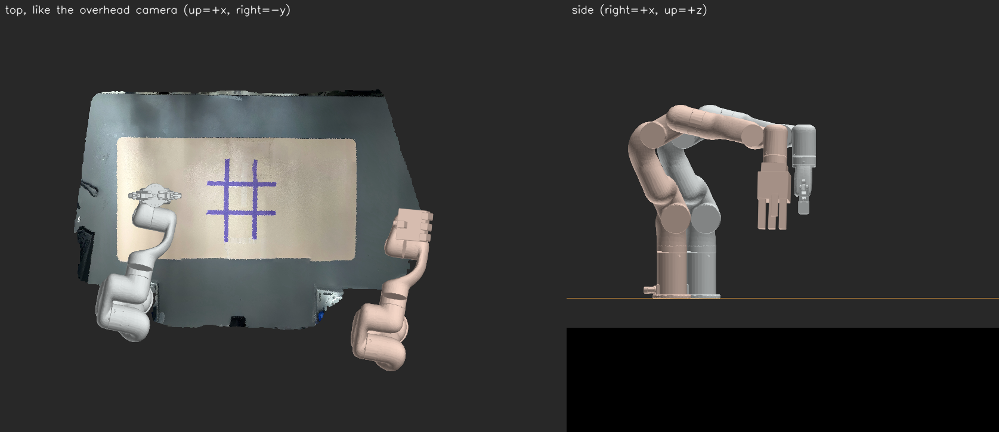

# EMS885 dual-xArm tabletop — Isaac Sim digital twin



Read-only, real-time mirror of the two xArm6 on the EMS885 table in NVIDIA Omniverse / Isaac Sim: the real joints drive the
USD robots, on top of the Scaniverse scan of the table (`examples/cosmos_edge_xarm/ems885_xarm_tabletop.glb`).
**No motion command is ever sent** — every robot connection here only reads.

Same design as the FANUC twin (`fanuc_lrmate200id_smc/`, verified in Isaac Sim 6.1 on the GB10): a text `.usda` whose Xforms
carry `[translate, orient, orient:joint]`, and a driver that only rewrites the `:joint` ops each frame.

```
Jetson (reaches 192.168.1.204 / 192.168.2.199)          GB10 / DGX Spark (Isaac Sim 6.1, ~/isaacsim-venv)
  twin/publish_joints.py  --UDP :5015-->  twin/omni_twin.py --source udp  ->  xarm_ems885.usda
  (xArm report stream, read-only)                                             both arms + textured table scan
```

| | |
|---|---|
| World frame | Robot1 (`xarm`) base frame: +x across the table away from the bases, +z up, metres. Table top z = 0. |
| Robot1 `xarm` | xArm6 + xArm Gripper, 192.168.1.204, base at (0, 0, 0) |
| Robot2 `xarm2` | xArm6 + LeapHand (drawn as boxes), 192.168.2.199, base at (−0.098, −0.855, 0) m, axes parallel to Robot1 — from the tabletop calibration, **not verified against its controller** (unreachable from the Jetson) |
| Arm model | UFACTORY `xarm_ros2/xarm_description` @ 62936f7e (BSD-3, `assets/LICENSE.xarm_ros2`): kinematics + visual STL. FK of the reported joints = controller `position` to < 0.5 mm (three poses, `test_twin.py`) |
| Scan placement | `align_scan.py`: tape/mat registration against the overhead camera, ~1 cm (see below) |

## Run

**0. Meshes** are stored with Git LFS (`*.stl` in `.gitattributes`): after cloning / pulling run `git lfs install && git lfs pull`.

**1. Build the stage** (once per machine, and after changing `twin_config.json`, the scan or its alignment; ~3 s, numpy only):
```bash
uv run python xarm_ems885_twin/twin/build_usd.py                 # Jetson
~/isaacsim-venv/bin/python xarm_ems885_twin/twin/build_usd.py    # GB10
```
Writes `xarm_ems885.usda` (~15 MB), `xarm_ems885_scan.jpg` and `xarm_ems885.twin.json` (git-ignored).

**2. Jetson: stream the joints** to the GB10 (can run while `run_xarm_live.py` or the calibration runs):
```bash
uv run python xarm_ems885_twin/twin/publish_joints.py --host <GB10-IP>                  # both arms, 30 Hz
uv run python xarm_ems885_twin/twin/publish_joints.py --host <GB10-IP> --read-gripper   # + gripper opening, 5 Hz
```
`--read-gripper` polls the gripper position over the controller's command socket (a read, but not free); it is off by default,
and the twin then shows the gripper open.

**3. GB10: the twin**
```bash
cd ~/lerobot
OMNI_KIT_ACCEPT_EULA=YES LD_PRELOAD=/lib/aarch64-linux-gnu/libgomp.so.1 DISPLAY=:1 \
  ~/isaacsim-venv/bin/python xarm_ems885_twin/twin/omni_twin.py --source udp --udp-port 5015 --camera persp
```
`--camera top` looks straight down like the real overhead camera (image up = +x, right = −y). `--source demo` moves both
arms without any robot. Each arm has a status light above its base (green live, orange > 0.5 s old, red no data) and a TCP trail
(blue Robot1, orange Robot2). The terminal prints joints, flange position (same numbers as the controller) and joint-limit warnings.

**Checks without Isaac Sim** (any machine):
```bash
uv run python xarm_ems885_twin/twin/omni_twin.py --source demo --no-render --duration 3
uv run python xarm_ems885_twin/twin/preview.py --read-robot xarm --out preview.png   # top + side render, Robot1 live (read-only)
uv run --with pytest pytest xarm_ems885_twin/twin/test_twin.py -q                    # 12 tests, ~5 s
```

## Scan alignment (`twin/align_scan.py`)

The GLB is in Scaniverse's frame (glTF, +Y up, arbitrary origin). `align_scan.py` puts it in the world frame:

1. overhead pixel → world XY: homography fitted to the tabletop calibration samples
   (`examples/tabletop_perception/calib/table_xy_calib_samples_xarm.json`, `uv` vs. the TCP position jogged onto the object);
   12 samples, 5.9 mm RMS, 9.6 mm leave-one-out;
2. scan → level: RANSAC table plane rotated flat (it was tilted 1.3°) and moved to z = 0;
3. both rendered top-down at 2 mm/px, purple tape + beige mat segmented, 2-D rigid fit (rotation search + ECC). The scan
   keeps its own metric scale; the tape grid measures 259 × 220 mm in the scan vs. 255 × 218 mm through the camera (1.5 %).

Result on 2026-09-24 (`examples/cosmos_edge_xarm/scan_alignment.json`): tape outline error 1.8 mm, tape IoU 0.74, mat IoU 0.74,
yaw 88.7°. Expect ~1 cm overall (homography error + the 1.5 % scale difference at the table edges).
`alignment_camera.png` shows the scan texture projected back into the photo, `alignment_topdown.png` the outlines.
Redo it after moving the camera, the mat or re-scanning (the photo must show the tape grid; empty table is best):
```bash
uv run python xarm_ems885_twin/twin/align_scan.py --capture /dev/video0       # or --photo <png>
uv run python xarm_ems885_twin/twin/build_usd.py
```

## Not done / to verify
* **Robot2 base pose** comes from the tabletop calibration; check it once Robot2 is reachable
  (`preview.py --read-robot xarm2`, or compare its flange in the twin with a known table point) and edit `twin_config.json`.
* **LeapHand** is a box outline (palm + fingers), not its CAD, and its fingers are not driven.
* **Table height** (ground plane, `table_height_m` = 0.75) is a guess; the scan stops at the table edge.
* **Not run in Isaac Sim yet**: `pxr` has no aarch64 wheel for the Jetson, so the stage was only checked structurally
  (`test_stage_matches_chain`) and rendered with `preview.py`. First GB10 run: `--source demo` and look at both arms and the scan.
* Perceived objects (`geometric_view.json`) are not shown yet; the FANUC twin's `scene.py` does that and could be added.

## Files
`twin_config.json` (arms, bases, scan paths) · `assets/` (xArm6 + gripper STL, BSD-3) · `twin/xarm_model.py` (model, FK, pxr-free) ·
`twin/glb.py` (GLB reader) · `twin/align_scan.py` · `twin/build_usd.py` · `twin/sources.py` (xArm / UDP / demo, read-only) ·
`twin/publish_joints.py` · `twin/omni_twin.py` · `twin/preview.py` · `twin/test_twin.py`
